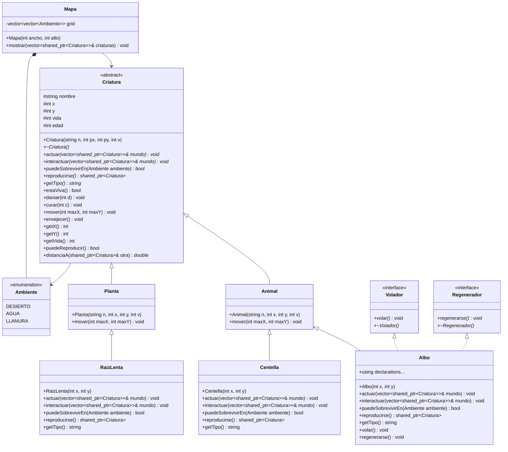

```mermaid
classDiagram
    direction TB
    
    %% Enumeración
    class Ambiente {
        <<enumeration>>
        DESIERTO
        AGUA
        LLANURA
    }

    %% Interfaces
    class Volador {
        <<interface>>
        +volar()* void
        +~Volador()*
    }

    class Regenerador {
        <<interface>>
        +regenerarse()* void
        +~Regenerador()*
    }


    class Criatura {
        <<abstract>>
        #string nombre
        #int x
        #int y
        #int vida
        #int edad
        +Criatura(string n, int px, int py, int v)
        +~Criatura()*
        +actuar(vector~shared_ptr~Criatura~~& mundo)* void
        +interactuar(vector~shared_ptr~Criatura~~& mundo)* void
        +puedeSobrevivirEn(Ambiente ambiente)* bool
        +reproducirse()* shared_ptr~Criatura~
        +getTipo()* string
        +estaViva() bool
        +daniar(int d) void
        +curar(int c) void
        +mover(int maxX, int maxY) void
        +envejecer() void
        +getX() int
        +getY() int
        +getVida() int
        +puedeReproducir() bool
        +distanciaA(shared_ptr~Criatura~& otra) double
    }

 
    class Planta {
        +Planta(string n, int x, int y, int v)
        +mover(int maxX, int maxY) void
    }

    class Animal {
        +Animal(string n, int x, int y, int v)
        +mover(int maxX, int maxY) void
    }

    class RaizLenta {
        +RaizLenta(int x, int y)
        +actuar(vector~shared_ptr~Criatura~~& mundo) void
        +interactuar(vector~shared_ptr~Criatura~~& mundo) void
        +puedeSobrevivirEn(Ambiente ambiente) bool
        +reproducirse() shared_ptr~Criatura~
        +getTipo() string
    }

    class Centella {
        +Centella(int x, int y)
        +actuar(vector~shared_ptr~Criatura~~& mundo) void
        +interactuar(vector~shared_ptr~Criatura~~& mundo) void
        +puedeSobrevivirEn(Ambiente ambiente) bool
        +reproducirse() shared_ptr~Criatura~
        +getTipo() string
    }

    class Albo {
        +Albo(int x, int y)
        +actuar(vector~shared_ptr~Criatura~~& mundo) void
        +interactuar(vector~shared_ptr~Criatura~~& mundo) void
        +puedeSobrevivirEn(Ambiente ambiente) bool
        +reproducirse() shared_ptr~Criatura~
        +getTipo() string
        +volar() void
        +regenerarse() void
        +using declarations...
    }


    class Mapa {
        -vector~vector~Ambiente~~ grid
        +Mapa(int ancho, int alto)
        +mostrar(vector~shared_ptr~Criatura~~& criaturas) void
    }


    Criatura <|-- Planta
    Criatura <|-- Animal
    Planta <|-- RaizLenta
    Animal <|-- Centella
    Animal <|-- Albo
 
    Volador <|.. Albo
    Regenerador <|.. Albo


    Mapa *-- Ambiente
    Mapa --> Criatura 

    Criatura --> Ambiente 

```
